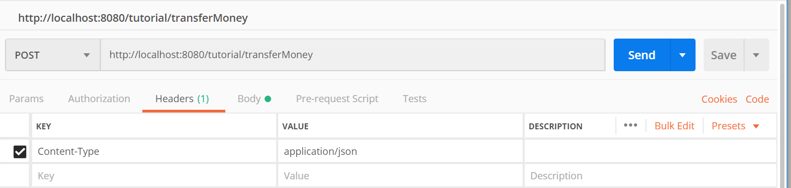
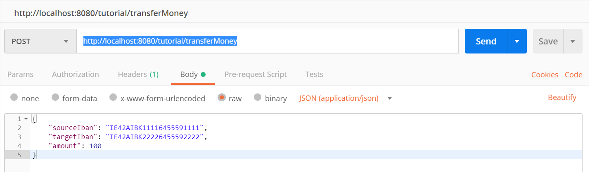
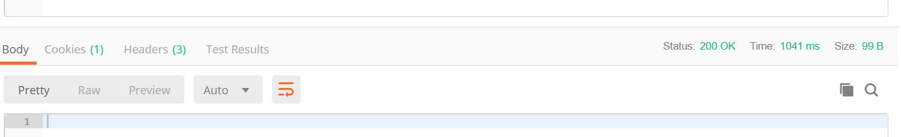
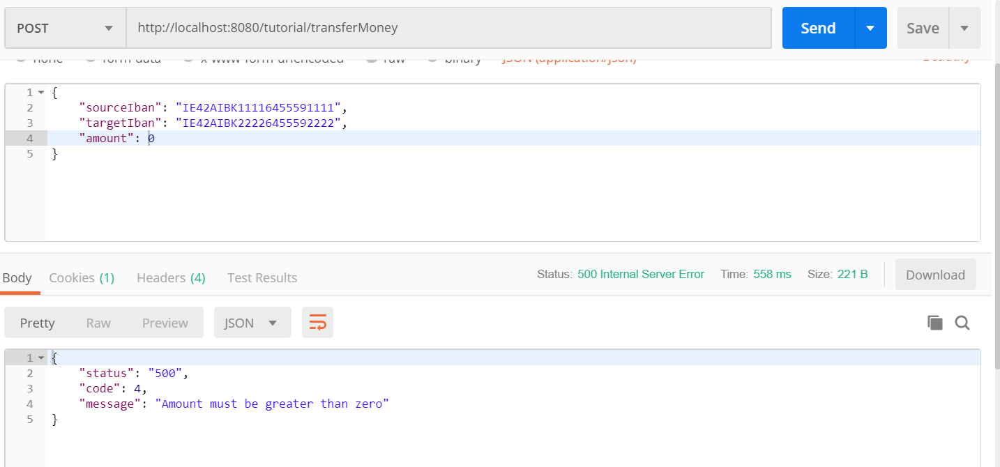

# Money Transfer with JEE
Simulate a money transfer between accounts. Provide Restful API with Wildfly application server 

## Getting Started
These instructions will get you a copy of the project up and running on your local machine for development and testing purposes.

### Prerequisites
- Apache Maven 3.5.4 or above
- java version "1.8.0_181"
- Postman or Curl (Optional for test)

## Running And Tests
### Running
Run the project
```
mvn clean install -Pstart-wildfly
```

Sample customers are created when the project up.

Sample Customers
```
Name : CUSTOMER1
IBAN : IE42AIBK11116455591111
Balance : 100
---------------------------
Name : CUSTOMER2
IBAN : IE42AIBK22226455592222
Balance : 0
``` 

### Manual Test

Sample JSON Data
```
{
	"sourceIban": "IE42AIBK11116455591111",
	"targetIban": "IE42AIBK22226455592222",
	"amount": 100
}
```

Endpoint
```
http://localhost:8080/tutorial/transferMoney
```

you should use POST method and add "Content-Type : application/json" to your http request

Sample Postman Header


Sample Postman Body


Expecting http result is 200 if everything is ok


Or you can get 500 status code with error code and description in case of fail


you can shutdown wildfly by using
```
Ctrl+C
```
or
```
mvn wildfly:shutdown
```

### Automated Test
All Fail and Success cases are tested 
```
mvn clean install -Ptest-suite
```


